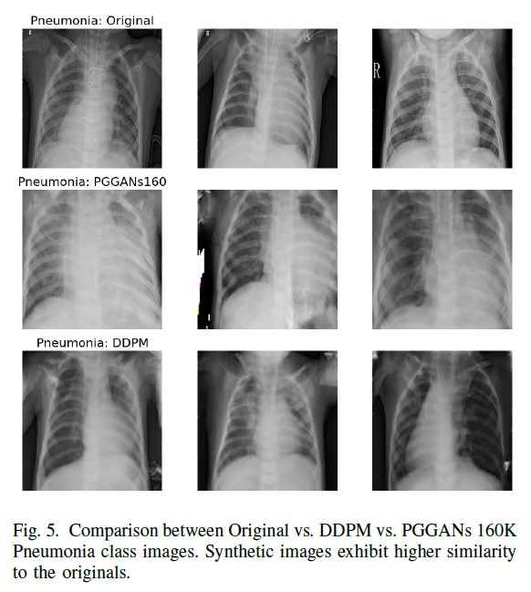

# GenAI Potentials to Enhance Medical Image Classification

**This repository contains the code and results presented in the above paper.**

**The paper** ([Link](https://doi.org/10.48550/arXiv.2412.12532)):  
Addressing Small and Imbalanced Medical Image Datasets Using Generative Models: A Comparative Study of DDPM and PGGANs with Random and Greedy K Sampling 

Authors:  
Iman Khazrak, Shakhnoza Takhirova, Mostafa M. Rezaee, Mehrdad Yadollahi, Robert C. Green II, Shuteng Niu

**Table of Contents** 
<div>
  &nbsp;&nbsp;&nbsp;&nbsp;<a href="#1-abstract"><i><b>1. Abstract</b></i></a>
</div>
&nbsp;

<div>
  &nbsp;&nbsp;&nbsp;&nbsp;<a href="#2-our-contributions"><i><b>2. Our Contributions</b></i></a>
</div>
&nbsp;

<div>
  &nbsp;&nbsp;&nbsp;&nbsp;<a href="#3-repository-contents"><i><b>3. Repository Contents</b></i></a>
</div>
&nbsp;

<div>
  &nbsp;&nbsp;&nbsp;&nbsp;<a href="#4-installation"><i><b>4. Installation</b></i></a>
</div>
&nbsp;

<div>
  &nbsp;&nbsp;&nbsp;&nbsp;<a href="#methodology"><i><b>5. Methodology</b></i></a>
</div>
&nbsp;

<div>
  &nbsp;&nbsp;&nbsp;&nbsp;<a href="#6-dataset"><i><b>6. Dataset</b></i></a>
</div>
&nbsp;

<details>
  <summary><a href="#7-code-execution-guide"><i><b>7. Code Execution Guide</b></i></a></summary>
  <div>
    &nbsp;&nbsp;&nbsp;&nbsp;&nbsp;&nbsp;&nbsp;&nbsp;&nbsp;&nbsp;<a href="#71-training-the-vgg16-model">7.1. Training the VGG16 Model</a><br>
    &nbsp;&nbsp;&nbsp;&nbsp;&nbsp;&nbsp;&nbsp;&nbsp;&nbsp;&nbsp;<a href="#72-training-the-custom-cnn-model">7.2. Training the Custom CNN Model</a><br>
    &nbsp;&nbsp;&nbsp;&nbsp;&nbsp;&nbsp;&nbsp;&nbsp;&nbsp;&nbsp;<a href="#73-training-the-ddpm-model">7.3. Training the DDPM Model</a><br>
    &nbsp;&nbsp;&nbsp;&nbsp;&nbsp;&nbsp;&nbsp;&nbsp;&nbsp;&nbsp;<a href="#74-training-the-pggans-model">7.4. Training the PGGANs Model</a><br>
    &nbsp;&nbsp;&nbsp;&nbsp;&nbsp;&nbsp;&nbsp;&nbsp;&nbsp;&nbsp;<a href="#75-calculating-the-fid-scores">7.5. Calculating the FID Scores</a><br>
  </div>
</details>
&nbsp;

<div>
  &nbsp;&nbsp;&nbsp;&nbsp;<a href="#8-results"><i><b>8. Results</b></i></a>
</div>
&nbsp;

<details>
  <summary><a href="#9-faq-and-citation-guidelines"><i><b>9. FAQ and Citation Guidelines</b></i></a></summary>
  <div>
    &nbsp;&nbsp;&nbsp;&nbsp;&nbsp;&nbsp;&nbsp;&nbsp;&nbsp;&nbsp;<a href="#71-training-the-vgg16-model">9.1. Frequently Asked Questions</a><br>
    &nbsp;&nbsp;&nbsp;&nbsp;&nbsp;&nbsp;&nbsp;&nbsp;&nbsp;&nbsp;<a href="#72-training-the-custom-cnn-model">9.2. Citation Guidelines</a><br>
  </div>
</details>
&nbsp;

## 1. Abstract

This project addresses the challenges of small and imbalanced medical image datasets by exploring two generative models: Denoising Diffusion Probabilistic Models (DDPM) and Progressive Growing Generative Adversarial Networks (PGGANs). These models are used to generate synthetic images to augment medical datasets, which improves the performance of classification algorithms.

We evaluate the impact of DDPM- and PGGAN-generated synthetic images on the performance of custom CNN, untrained VGG16, pretrained VGG16, and pretrained ResNet50 models, demonstrating significant improvements in model robustness and accuracy, especially in imbalanced scenarios.

For more details, please refer to the [paper](https://doi.org/10.48550/arXiv.2412.12532).

## 2. Our Contributions

- **An Evaluation Framework**:    
A comprehensive framework to systematically evaluate and compare the quality of images produced by DDPM and PGGANs.

- **High-Quality Image Generation**:     
Demonstrates that producing high-quality and diverse synthetic images using small medical image datasets is feasible.   

- **Accuracy Improvement**:     
Incorporating synthetic images into the training datasets significantly improves the accuracy of classification algorithms.    

- **Increased Robustness**:     
Adding synthetic images to the original datasets enhances the robustness of classification algorithms.

- **Faster Convergence**:     
The inclusion of synthetic images accelerates the convergence of classification algorithms.

## 3. Repository Contents
```
.
├── Cite us
│   └── README.md
├── Codes
│   ├── Classification Models
│   │   ├── VGG_help.py
│   │   ├── plots.py
│   │   ├── pretrained_balanced-VGG_ResNet-epo5.ipynb
│   │   ├── pretrained_imbalanced-VGG_ResNet-epo5.ipynb
│   │   ├── untrained_balanced-VGG_ResNet.ipynb
│   │   └── untrained_imbalanced-VGG_ResNet.ipynb
│   ├── DDPM
│   │   └── DDPM_Pytorch.ipynb
│   ├── FID
│   │   ├── FID.ipynb
│   │   ├── Results.txt
│   │   ├── fid.sh
│   │   ├── fid_comparison_plot.png
│   │   ├── fid_comparison_plot_full.png
│   │   └── fid_plot.ipynb
│   └── PGGANs
│       ├── ModelTrainingImages
│       │   ├── PGAN_Architecture.png
│       │   ├── PGAN_NRM_loss.png
│       │   └── PGAN_PNM_loss.png
│       ├── progan_modules.py
│       ├── train.py
│       ├── train_config_NRM200k_2024-04-11_20_17.txt
│       ├── train_config_PNM200k_2024-04-11_21_23.txt
│       ├── train_log_NRM200k_2024-04-11_20_17.txt
│       └── train_log_PNM200k_2024-04-11_21_23.txt
├── Dataset
│   ├── All_Data
│   │   ├── NORMAL
│   │   └── PNEUMONIA
│   ├── Balanced_data
│   │   ├── Greedy_K_Selection
│   │   │   ├── Mixed
│   │   │   │   ├── DDPM_Mixed
│   │   │   │   │   ├── NORMAL
│   │   │   │   │   └── PNEUMONIA
│   │   │   │   ├── PGGANS150_Mixed
│   │   │   │   │   ├── NORMAL
│   │   │   │   │   └── PNEUMONIA
│   │   │   │   └── PGGANS160_Mixed
│   │   │   │       ├── NORMAL
│   │   │   │       └── PNEUMONIA
│   │   │   ├── Original
│   │   │   │   └── selected_images
│   │   │   │       ├── NORMAL
│   │   │   │       └── PNEUMONIA
│   │   │   └── Test_greedy
│   │   │       └── Test
│   │   │           ├── NORMAL
│   │   │           └── PNEUMONIA
│   │   └── Randeom_Selection
│   │       ├── Mixed
│   │       │   ├── DDPM_Mixed
│   │       │   │   ├── NORMAL
│   │       │   │   └── PNEUMONIA
│   │       │   ├── PGGANS150_Mixed
│   │       │   │   ├── NORMAL
│   │       │   │   └── PNEUMONIA
│   │       │   └── PGGANS160_Mixed
│   │       │       ├── NORMAL
│   │       │       └── PNEUMONIA
│   │       ├── Original_Random
│   │       │   ├── NORMAL
│   │       │   └── PNEUMONIA
│   │       └── Test_random
│   │           ├── NORMAL
│   │           └── PNEUMONIA
│   └── Imbalanced_data
│       ├── Greedy_K_Selection
│       │   ├── Mixed
│       │   │   ├── DDPM_Mixed
│       │   │   │   ├── NORMAL
│       │   │   │   └── PNEUMONIA
│       │   │   ├── PGGANS150_Mixed
│       │   │   │   ├── NORMAL
│       │   │   │   └── PNEUMONIA
│       │   │   └── PGGANS160_Mixed
│       │   │       ├── NORMAL
│       │   │       └── PNEUMONIA
│       │   ├── Original
│       │   │   ├── NORMAL
│       │   │   └── PNEUMONIA
│       │   └── Test_greedy
│       │       ├── NORMAL
│       │       └── PNEUMONIA
│       └── Randeom_Selection
│           ├── Mixed
│           │   ├── DDPM_Mixed
│           │   │   ├── NORMAL
│           │   │   └── PNEUMONIA
│           │   ├── PGGANS150_Mixed
│           │   │   ├── NORMAL
│           │   │   └── PNEUMONIA
│           │   └── PGGANS160_Mixed
│           │       ├── NORMAL
│           │       └── PNEUMONIA
│           ├── Original
│           │   ├── NORMAL
│           │   └── PNEUMONIA
│           └── imbalanced_test
│               ├── NORMAL
│               └── PNEUMONIA
├── Figures
│   ├── Classification_boxplots.png
│   ├── Classification_boxplots_F1.png
│   ├── DDPM_forward.png
│   ├── Dataset.png
│   ├── FID_plot.png
│   ├── FID_table.png
│   ├── Flowchart2.png
│   ├── Logo_DDPM_X-Ray.jpg
│   ├── Normal_gallary.png
│   ├── Normal_vs_Original_ddpm_3images.png
│   ├── Pneumina_gallary.png
│   ├── Pneumonia_Original_ddpm_gans_3images.png
│   ├── README.md
│   ├── Run_results.png
│   └── VGG16_and_CNN_performance_5 runs_2.png
├── Results
│   ├── Descriptive_Statistics.xlsx
│   ├── Greedy-k_Method_Analysis.xlsx
│   ├── Model_Quality_Evaluation.xlsx
│   ├── README.md
│   └── Random_Method_Analysis.xlsx
├── .gitignore
├── Code.zip
├── DDPM_X_Ray___Paper.pdf
├── LICENSE
├── README.md
├── environment.yml
├── requirements.txt
└── tree.txt

85 directories, 64659 files
```

## 4. Installation 

***Step 1***:  
Please consider starring the repository to support its development.

***Step 2***:
Fork the repository to your GitHub account by using the "Fork" option available at the top of the repository page.

***Step 3***:   
Clone the repository by replacing `your-username` with your GitHub username in the command below. Then, navigate to the project directory.      
```bash
git clone https://github.com/your-username/DDPM_X-Ray.git    
cd DDPM_X-Ray    
```

***Step 4***:    
Install Python and the required packages by following one of the methods below:  

- ***Method 1: Using Conda***

  Create a Conda environment using the `environment.yml` file:      
  ```bash       
  conda env create -f environment.yml      
  conda activate DDPM_X-Ray        
  ```     

- ***Method 2: Using venv***    
  
  1. Ensure you are in the project directory `DDPM_X-Ray`.      

  2. Create a virtual environment using `venv`:   
      ```bash
      python -m venv DDPM_X-Ray
      ```

  3. Activate the virtual environment:
      - On ***Mac/Linux***:
        ```bash
        source DDPM_X-Ray\Scripts\activate
        ```
      - On ***Windows***:
        ```bash
        DDPM_X-Ray\Scripts\activate
        ```

  4. Install the required packages using the `requirements.txt` file:
      ```bash
      pip install -r requirements.txt
      ```

- ***Method 3: Without setting up an environment***    

  1. Make sure you have `python=3.10.14` installed on your machine.

  2. Install the required packages using the `requirements.txt` file:
      ```bash
      pip install -r requirements.txt
      ```

## 5. Methodology
**Note:**   
Click on the figure to open it in a new window for a clearer and more detailed view of its content.


## 6. Dataset

The dataset used in this study consists of Chest X-ray (CXR) images with two classes: *NORMAL* and *PNEUMONIA*. The dataset is structured as follows:
- `dataset/NORMAL`: Contains normal CXR images.
- `dataset/PNEUMONIA`: Contains pneumonia CXR images.


## 7. Code Execution Guide

### 7.1. Training the VGG16 Model

1. Prepare the dataset:
    ```python
    from VGG_help import prepare_dataset
    dataset_dir = 'path/to/dataset'
    class_labels = ['NORMAL', 'PNEUMONIA']
    X, y = prepare_dataset(dataset_dir, class_labels)
    ```

2. Train the VGG16 model using cross-validation:
    ```python
    from VGG_help import cv_train_vgg_model
    fold_metrics_df, best_model = cv_train_vgg_model(X, y)
    ```

3. Plot training history:
    ```python
    from VGG_help import plot_train_history
    plot_train_history(fold_metrics_df, 'VGG16 Training History', 'vgg16_training_history.png')
    ```

### 7.2. Training the Custom CNN Model

1. Load the dataset and prepare it as shown in the VGG16 training section.

2. Train the custom CNN model using cross-validation:
    ```python
    from CNN_Classification import fit_classification_model_cv
    fold_metrics_df, best_model = fit_classification_model_cv(X, y)
    ```

### 7.3. Training the DDPM model

1. Open the `DDPM_Pytorch.ipynb` notebook.
2. Follow the instructions to train and evaluate the DDPM model.

### 7.4. Training the PGGANs model

1. Train the PGGAN model using the `train.py` script:
    ```bash
    python train.py --path path/to/dataset --trial_name trial1 --gpu_id 0
    ```

<p align="center">
  
  
</p>


### 7.5. Calculating the FID Scores

1. Open the `fid_plot.ipynb` notebook.
2. Follow the instructions to calculate and plot the FID scores.


## 8. Results

The results from the cross-validation and test set evaluations will provide insights into the performance improvements achieved by using synthetic images generated by DDPM and PGGANs.


## 9. FAQ and Citation Guidelines

### Frequently Asked Questions
- **For any questions or issues**, feel free to reach out via email:
  - Iman Khazrak: [ikhazra@bgsu.edu](mailto:ikhazra@bgsu.edu)
  - Mostafa Rezaee: [mostam@bgsu.edu](mailto:mostam@bgsu.edu)

### Citation Guidelines
If you find our work helpful or relevant to your research, please consider citing it. Below are the citation formats:

- **IEEE Style**:  
  I. Khazrak, S. Takhirova, M. M. Rezaee, M. Yadollahi, R. C. Green II, and S. Niu,  
  "Addressing Small and Imbalanced Medical Image Datasets Using Generative Models: A Comparative Study of DDPM and PGGANs with Random and Greedy K Sampling," arXiv preprint, vol. 2412.12532, 2024. [Online]. Available: [https://arxiv.org/abs/2412.12532](https://arxiv.org/abs/2412.12532).

- **BibTeX**:
  ```bibtex
  @misc{khazrak2024addressingsmallimbalancedmedical,
      title={Addressing Small and Imbalanced Medical Image Datasets Using Generative Models: A Comparative Study of DDPM and PGGANs with Random and Greedy K Sampling}, 
      author={Iman Khazrak and Shakhnoza Takhirova and Mostafa M. Rezaee and Mehrdad Yadollahi and Robert C. Green II and Shuteng Niu},
      year={2024},
      eprint={2412.12532},
      archivePrefix={arXiv},
      primaryClass={cs.CV},
      url={https://arxiv.org/abs/2412.12532}, 
  }
  ```

Thank you for your support!

<!-- 
# Commands:

To make tree (folders and files):   
Mac/Linux: tree -a --dirsfirst -I '.git' > tree.txt  

To make tree (just folders):
tree -d > tree.txt

To delete Zone.Identifier files which are made by windows:          
find . -type f -name "*Zone.Identifier*" -exec rm -f "{}" +   

To count the number of files:  
find . -type f | wc -l                                        
-->